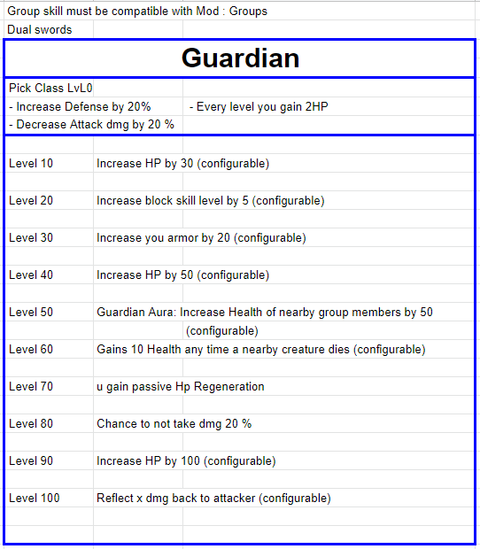
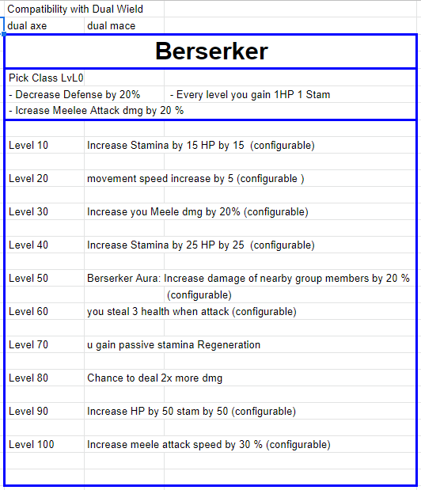
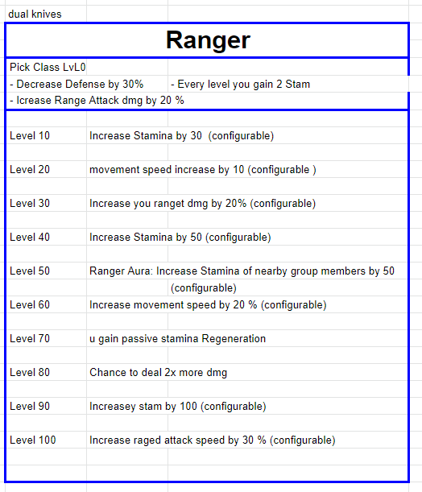

# Features

###  [🏠To the main page](https://github.com/FroggerHH/Frogger-Tribe-Classes-WIKI#readme)

The mod adds 6 classes that increase certain characteristics of the player and the user interface of the class.

The higher the level, the higher the added characteristics.

### Types of added characteristics:
* Health
* Regeneration
* Stamina Recovery
* Armor
* Protection (armor as a percentage)
* Movement speed
* Vampirism
* Chance of not taking damage
* Chance to return damage
* Recoverable damage
* Chance to deal X2 damage
* Portable weight
* Attack speed
* Damage Modifier (total damage)

## Classes:
* Guardian
* Berserk
* Ranger (at the final stage of development)
* Druid (in development)

## Guardian

## Berserk

## Ranger

## Druid

