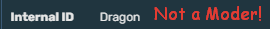

# Настройки мобов

###  [🏠На главную](https://github.com/FroggerHH/Frogger-Tribe-Classes-WIKI#readme)
## ```com.FroggerTribeClasses.MonstersSettings.json.json``` 
➡[Создаваемая конфигурация по умолчанию](config/com.FroggerTribeClasses.MonstersSettings.json.json)


blocks - Список элементов MonstersInfo с информацией о мобе
  * Name - Имя (индефикатор) моба. Точно как на [вики](https://valheim.fandom.com/wiki/Skills). 
  * exp - Кол-во получаемого опыта с данного моба.


* [📒Основной конфиг файл](https://github.com/FroggerHH/Frogger-Tribe-Classes-WIKI/blob/main/MainConfig.md#основной-конфиг-файл) 
* [⚙️Настройки классов](https://github.com/FroggerHH/Frogger-Tribe-Classes-WIKI/blob/main/LevelTree.md#настройки-классов) 
